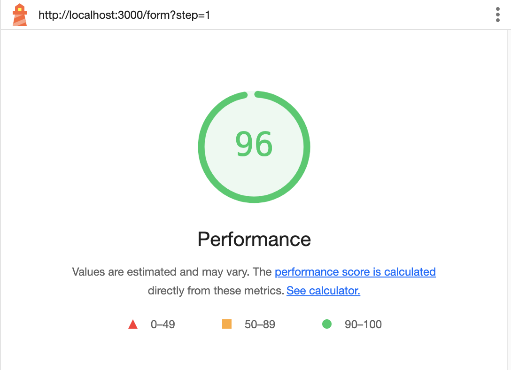
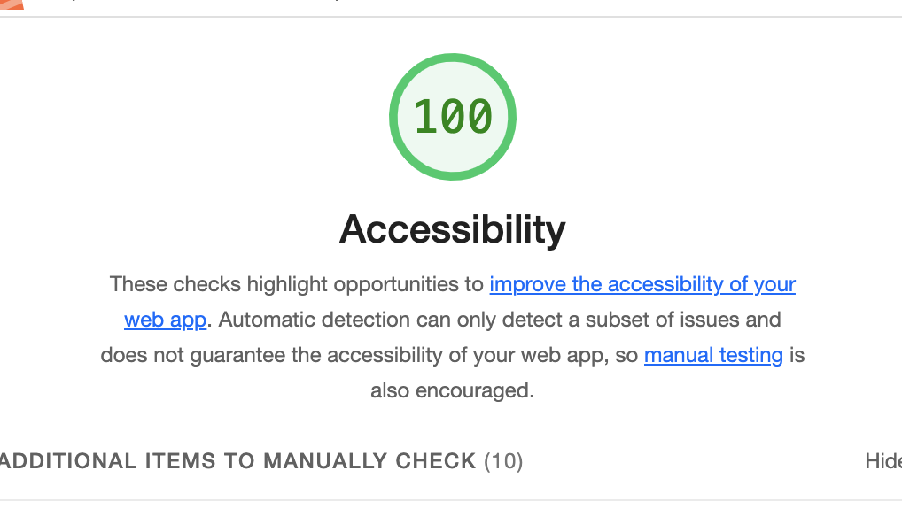

<p float="left">
  
  
</p>


This is a [Next.js](https://nextjs.org) project bootstrapped with [`create-next-app`](https://nextjs.org/docs/pages/api-reference/create-next-app).

## Getting Started

First, run the development server:

```bash
npm run dev
# or
yarn dev
# or
pnpm dev
# or
bun dev
```

Open [http://localhost:3000](http://localhost:3000) with your browser to see the result.

## Project Structure

```
scalapay-form-test/
├── components/         # Reusable UI components (inputs, buttons, steps, errors)
├── pages/              # Next.js pages (form, index, _app, _document)
├── validation/         # Zod schemas and validation logic
├── store/              # Zustand store for form state
├── hooks/              # Custom React hooks
├── types/              # TypeScript types
├── __tests__/          # Unit and integration tests
├── cypress/            # End-to-end tests
├── public/             # Static assets
├── styles/             # CSS modules
├── .husky/             # Git hooks
├── .lintstagedrc.json  # Lint-staged config
├── package.json        # Dependencies & scripts
├── tsconfig.json       # TypeScript config
└── yarn.lock           # Yarn lockfile
```

### Main Components

- `components/AccountStep.tsx`, `AddressStep.tsx`: Form steps for account and address data.
- `components/FormInput.tsx`, `FormButton.tsx`, `FieldError.tsx`: Input, button, and error display.
- `pages/form.tsx`: Main form logic, step navigation, and submission.
- `validation/schemas.ts`, `validate.ts`: Zod schemas and async validation functions.
- `store/formSlice.ts`: Zustand store for managing form state and errors.

---

## Validation Flow

### 1. Schemas

- Defined in `validation/schemas.ts` using Zod.
- Separate schemas for account and address data, then combined into a form schema.
- Each field includes custom error messages and transformations (e.g., trimming, case normalization).

### 2. Validation Functions

- Located in `validation/validate.ts`:
  - `validateAccount(data)`: Validates account step using Zod.
  - `validateAddress(data)`: Validates address step.
  - Both return `{ success, data, errors }` objects.
  - Errors are mapped to field names for easy UI display.
- Some fields (like tax code) use async custom validators (e.g., simulated backend check).

### 3. UI Integration

- On form submission (per step), the relevant validation function is called.
- If validation fails, errors are set in the Zustand store and displayed via `FieldError`.
- On success, data is transformed and the user proceeds to the next step or submits the form.

### 4. State Management

- Zustand (`store/formSlice.ts`) holds form values, step, and error state.
- UI components consume state and update it via hooks and handlers.

---

## Libraries & Tools

### Runtime

- **Next.js**: React framework for SSR and routing.
- **React**: UI library.
- **Zod**: Schema validation and parsing.
- **Zustand**: Lightweight state management.
- **date-fns**: Date utility functions.
- **react-datepicker**, **react-flatpickr**: Date picker components.
- **TypeScript**: Static typing for safer code.

### Developer Experience

- **Jest**: Unit testing.
- **@testing-library/react**: React component testing.
- **Cypress**: End-to-end browser testing.
- **eslint** & **eslint-config-next**: Linting for code quality.
- **husky**: Git hooks for enforcing pre-commit checks.
- **lint-staged**: Run linters on staged files.
- **axe-core**, **cypress-axe**: Accessibility testing.

### Misc

- **@types/**: TypeScript type definitions for libraries.
- **CSS Modules**: Scoped CSS for components.

---

## Scripts

All scripts use Yarn as the package manager.

| Script         | Description                      |
|----------------|----------------------------------|
| `yarn dev`     | Start local dev server           |
| `yarn build`   | Build for production             |
| `yarn start`   | Start production server          |
| `yarn test`    | Run Jest unit tests              |
| `yarn test:watch` | Watch mode for Jest           |
| `yarn test:coverage` | Coverage for Jest          |
| `yarn lint`    | Run ESLint                      |
| `yarn eslint:fix` | Auto-fix lint issues          |
| `yarn cy:open` | Open Cypress GUI                 |
| `yarn cy:run`  | Run Cypress tests headlessly     |

---

## Testing

- **Unit tests**: In `__tests__/` using Jest and Testing Library.
- **E2E tests**: In `cypress/` using Cypress.
- **Accessibility**: Automated checks with axe-core and cypress-axe.

---

## Development

1. **Install dependencies:**
   ```sh
   yarn install
   ```
2. **Run the dev server:**
   ```sh
   yarn dev
   ```
3. **Open [http://localhost:3000](http://localhost:3000) and start filling the form.**

